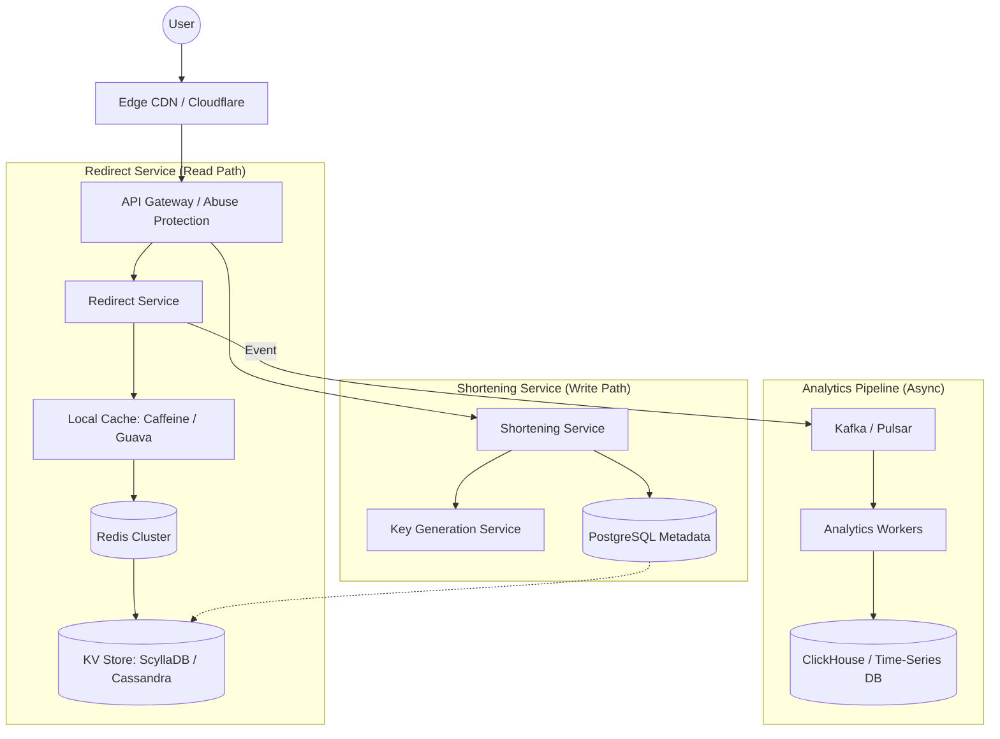

# URL Shortener System Design (Bitly-like)

An exploration into designing a globally distributed, high-availability URL shortening service capable of handling internet-scale traffic and multi-terabyte datasets.

---

## Overview

This document outlines the architecture for a service designed to handle **1B daily redirects** with sub-50ms latency. The system is designed using a decoupled microservices approach, separating the write-heavy shortening logic from the read-heavy redirection path.

!!! info "Design Philosophy"
    We prioritize **Availability** and **Low Latency** (AP in CAP theorem) for the redirection path, utilizing eventual consistency for analytics and metadata updates.

---

## Requirements

### Functional Requirements
* **URL Shortening**: Generate unique, deterministic or random short aliases.
* **URL Redirection**: High-speed resolution and `302 Found` redirection.
* **Link Analytics**: Real-time tracking of click-through rates (CTR) and user telemetry.

### Non-Functional Requirements
* **Latency**: <50ms redirect time via multi-layer caching.
* **Scalability**: Support for **100M Daily Active Users (DAU)**.
* **Throughput**: Optimized for **10,000+ Requests Per Second (RPS)**.
* **Durability**: Store **5B total lifetime URLs** (~2.5TB persistent data).

---

## High-Level Architecture

The system utilizes a **Command Query Responsibility Segregation (CQRS)** inspired pattern to ensure the analytics pipeline does not contend for resources with the core redirect logic.

---

## Request Flow

=== "Redirection (Read Path)"
    1. **Edge**: CDN resolves viral links at the edge.
    2. **L1 Cache**: Service-local memory (Caffeine) for hot keys.
    3. **L2 Cache**: Distributed Redis cluster for frequent lookups.
    4. **L3 Storage**: ScyllaDB / Cassandra for high-performance KV retrieval.

=== "Shortening (Write Path)"
    1. **KGS**: Key Generation Service provides pre-calculated unique IDs.
    2. **MetaDB**: PostgreSQL stores user ownership and metadata.
    3. **Propagation**: New mappings are pushed to the KV store and L2 cache.

---

## System Diagram {: .no-toc }

## Data Modeling

To handle high-scale reads and writes, the data layer is specialized across three different storage engines: **Relational** (Account/Auth), **Key-Value** (Redirection), and **Time-Series** (Analytics).

### 1. Primary Redirection Store (Key-Value)
The primary mapping is stored in **ScyllaDB** or **Cassandra** to ensure linear scalability.

| Column Name  | Type      | Description                                      |
| :----------- | :-------- | :----------------------------------------------- |
| `short_url`  | `string`  | **Primary Key**. Base62 encoded unique alias.   |
| `long_url`   | `string`  | Original destination URL (up to 2048 chars).     |
| `uid`        | `string`  | Owner identifier for management/deletion.        |
| `created_at` | `date`    | ISO-8601 timestamp of record creation.           |
| `ttl_expiry` | `date`    | Automatic expiration timestamp for the record.   |

### 2. Relational Metadata (PostgreSQL)
Used for user accounts, API keys, and persistent configurations.

---

## Capacity Estimation

A critical part of system design is ensuring the infrastructure can handle the projected growth over a 5-year horizon.

### Storage Calculation
* **Total Records**: 5 Billion URLs.
* **Size per Record**: ~500 bytes (accounting for long URLs and indexing overhead).
* **Total Persistent Storage**: $5 \times 10^9 \times 500 \text{ bytes} \approx \mathbf{2.5 \text{ TB}}$.

### Throughput Calculation
* **Daily Traffic**: 1 Billion Redirects.
* **Average RPS**: $1,000,000,000 / 86,400 \text{ seconds} \approx \mathbf{11,574 \text{ Requests/Sec}}$.
* **Peak Traffic (10x)**: $\mathbf{115,000+ \text{ RPS}}$ during viral events.

---

## Implementation Deep-Dive

### 1. Unique ID Generation (KGS)
To avoid the overhead of checking for collisions in the database during every write, we implement a **Key Generation Service (KGS)**.

* **Pre-computation**: A separate service pre-generates 6-8 character Base62 strings.
* **Key States**: Keys are marked as `Available`, `Used`, or `Cooling` (for expired keys to prevent immediate reuse).
* **Efficiency**: The Shortening Service pulls keys in batches (e.g., 1000 keys) to local memory, making the generation process $O(1)$.

### 2. High-Performance Redirection Path
To achieve our `< 50ms` latency goal, we implement a multi-layered cache strategy:

!!! note "Multi-Layer Cache Strategy"
    1. **L1 (Local)**: The most viral links (top 1%) are stored in the application's RAM (Caffeine Cache). This has **zero network latency**.
    2. **L2 (Distributed)**: Redis Cluster stores frequently accessed links that didn't fit in L1.
    3. **L3 (Persistent)**: ScyllaDB serves as the source of truth for all valid mappings.

---

## Engineering Recommendations

!!! success "Performance & Reliability"
    * **Bloom Filters**: Deploy Bloom filters at the Gateway level. If a filter says a `short_url` doesn't exist, we reject the request immediately without hitting the cache or database.
    * **Async Analytics**: Never update click counts synchronously. Push events to **Kafka**, and let background workers update the counters in batches.
    * **CDN Caching**: For public links, set `Cache-Control: public, max-age=300`. This allows the CDN to serve the 302 redirect for 5 minutes, protecting your origin from massive spikes.

---

## Observability & Monitoring

We track system health through the following Service Level Indicators (SLIs):

| SLI | Target | Tooling |
| :--- | :--- | :--- |
| **P99 Redirection Latency** | < 50ms | Prometheus / Grafana |
| **Cache Hit Ratio (L1+L2)** | > 90% | Redis Exporter |
| **Write Availability** | 99.9% | Health Checks |
| **Kafka Consumer Lag** | < 1 minute | Confluent Control Center |

---

## Deployment Strategy

!!! example "Scalability & Global Reach"
    * **Containerization**: Use Kubernetes (K8s) for horizontal autoscaling based on CPU/Memory usage.
    * **Geo-Distribution**: Deploy the Redirect Service in multiple AWS/GCP regions (e.g., US-East, EU-West, Asia-South) to bring the redirect as close to the user as possible.